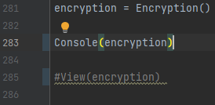
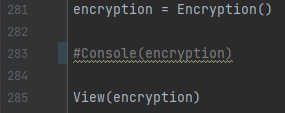

# Samuel, Benjamin 1ARITH

Ce programme permet de chiffrez ou déchiffrez des mots grace à un cylindre et une clé de chiffrement.

## Mode Console

Pour lancer la **version console**, veuillez suivre ces étapes :

1. Assurez-vous que la __ligne 283__ du fichier soit décommentée.
2. Exécutez le programme en appuyant sur la flèche verte dans PyCharm.

### Fontionnement

Suffit juste de lancer le programme et de suivre les instructions, **la clé de chiffrement est généré automatiquement**.
Le cylindre aussi est généré automatiquement.
**Sauf pour le déchiffrement**, il faut rentrer la clé de chiffrement et le cylindre (dans le fichier data.txt).

## Mode Tkinter

Pour lancer la version Tkinter, suivez ces étapes :

1. Assurez-vous que la __ligne 285__ du fichier soit décommentée.
2. Exécutez le programme en appuyant sur la flèche verte dans PyCharm.

Une fois le mode de lancement choisi et les étapes appropriées suivies, le programme se lancera et vous pourrez commencer à l'utiliser.

N'hésitez pas à appuyer sur la flèche verte dans PyCharm pour exécuter le programme.

***Nous avons ajouter un triage pour mettre le mot dans sa case respectif***

## Utilisation

Si vous voulez changer le cylindre, vous devez modifier dans le fichier **data.txt**
