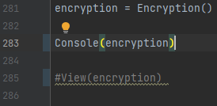
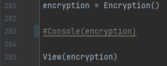

# Samuel, Benjamin 1ARITH

Ce programme est conçu pour effectuer des opérations arithmétiques simples.

## Mode Console

Pour lancer la version console, veuillez suivre ces étapes :

1. Assurez-vous que la __ligne 283__ du fichier soit décommentée.
2. Exécutez le programme en appuyant sur la flèche verte dans PyCharm.

## Mode Tkinter

Pour lancer la version Tkinter, suivez ces étapes :

1. Assurez-vous que la __ligne 285__ du fichier soit décommentée.
2. Exécutez le programme en appuyant sur la flèche verte dans PyCharm.

Une fois le mode de lancement choisi et les étapes appropriées suivies, le programme se lancera et vous pourrez commencer à l'utiliser.

N'hésitez pas à appuyer sur la flèche verte dans PyCharm pour exécuter le programme.

